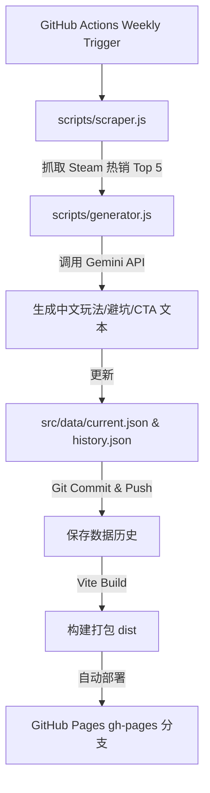

# 🎮 Steam 週熱销榜 AI 攻略網站與自動化工作流

这是一个为游戏玩家打造的高端、全自动化的游戏评测与新手指南门户。

该系统包含一个全自动的 Node.js 爬虫，每周拉取 Steam 最畅销的前 5 名游戏，并使用 **Google Gemini API** 自动生成 300 字的中文化深度玩法解析、新手避坑指南和促销导购。前端采用 React + Vite + Vanilla CSS 精心构建，包含暗黑霓虹风格的高级视觉设计、预留 Google AdSense 广告位及 Humble Bundle 联盟营销按钮。

---

## 🚀 工作流程架构



---

## 🛠️ 项目结构

```
steam-game-portal/
├── .github/workflows/
│   └── weekly-update.yml       # 每周自动运行的 GitHub Actions 脚本
├── scripts/
│   ├── scraper.js              # Steam 榜单数据抓取脚本
│   └── generator.js            # 调用 Gemini API 并汇总数据的生成脚本
├── src/
│   ├── components/
│   │   ├── AdSlot.jsx          # Google AdSense 广告位组件
│   │   └── GameCard.jsx        # 游戏详情与攻略展示卡片
│   ├── data/
│   │   ├── current.json        # 当前周的 Top 5 数据
│   │   └── history.json        # 累积的往期历史数据库
│   ├── App.jsx                 # 前端主入口和侧边栏布局
│   ├── index.css               # 暗黑霓虹、毛玻璃质感 CSS 样式系统
│   └── main.jsx                # React 渲染入口
├── index.html                  # 页面模板与 Google AdSense script 标签
├── vite.config.js              # Vite 构建与 Pages 路径配置
└── package.json                # 项目依赖
```

---

## ⚙️ 部署与 GitHub 配置

本系统专为 GitHub Actions 和 GitHub Pages 设计，您只需将代码上传到 GitHub 并进行简单配置，即可实现零维护运行。

### 第一步：设置 GitHub 仓库密钥 (Secrets)
进入您的 GitHub 仓库设置 `Settings` -> `Secrets and variables` -> `Actions`，添加以下 **Repository Secrets**：

1. **`GEMINI_API_KEY` (必填)**：
   - 访问 [Google AI Studio](https://aistudio.google.com/) 免费申请一个 Gemini API 密钥。
   - 填入该密钥。

2. **`VITE_HUMBLE_PARTNER` (可选)**：
   - 填入您的 Humble Bundle 合作伙伴/联属会员 Token（例如：`your_partner_id`）。
   - 如果不设置，默认会使用 `gameportal`。

### 第二步：开启 GitHub Actions 写入权限
由于工作流需要将每周更新的 JSON 数据提交回您的仓库，您需要开启写入权限：
1. 进入仓库的 `Settings` -> `Actions` -> `General`。
2. 滚动到底部 **Workflow permissions**，选择 **Read and write permissions**。
3. 点击 **Save**。

### 第三步：设置 GitHub Pages 托管
当 GitHub Actions 首次运行成功后，它会生成一个 `gh-pages` 分支。
1. 进入仓库的 `Settings` -> `Pages`。
2. 在 **Build and deployment** -> **Source** 中选择 **Deploy from a branch**。
3. 分支 (Branch) 选择 **`gh-pages`** 目录选择 **`/ (root)`**。
4. 点击 **Save**。

现在，您的攻略网站已经上线了！

---

## 💻 本地运行与开发

如果您想在本地调试前端或测试脚本，需要先安装 [Node.js](https://nodejs.org/)。

### 1. 安装依赖
```bash
npm install
```

### 2. 启动前端开发服务器
```bash
npm run dev
```
打开浏览器访问控制台输出的本地端口（例如 `http://localhost:5173`）预览网站。

### 3. 本地运行爬虫与生成测试
在根目录创建 `.env` 文件并填入您的 API Key：
```env
GEMINI_API_KEY=你的_gemini_api_key
VITE_HUMBLE_PARTNER=你的_humble_bundle_id
```
然后运行：
```bash
# 同时运行爬虫与 AI 生成
npm run workflow
```
运行完成后，`src/data/current.json` 和 `src/data/history.json` 会被更新，前端会自动热重载展示最新爬取的内容。

---

## 💵 收益与变现

1. **Google AdSense**：
   - 页面已经嵌入了您的 Publisher ID `pub-4561141525427286`。
   - 当网站上线并积累一定流量后，您可以向 Google AdSense 申请该域名的广告展示权限，广告位将自动生效并开始变现。
2. **Humble Bundle Affiliate**：
   - 网站中每个游戏的“Humble Bundle 优惠”按钮都已绑定了您的 Partner Token。
   - 读者通过该链接购买游戏或订阅时，您将获得分成收益。
